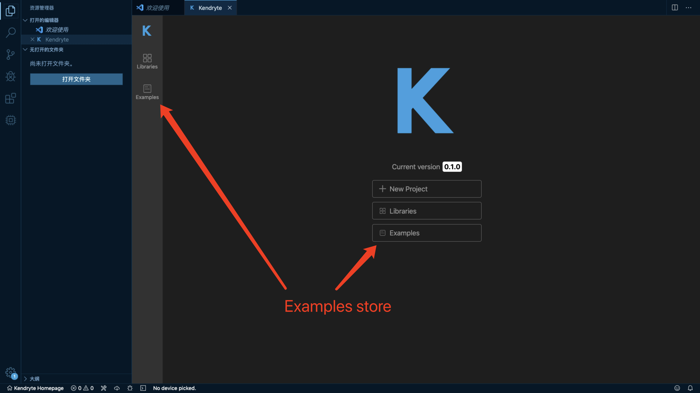
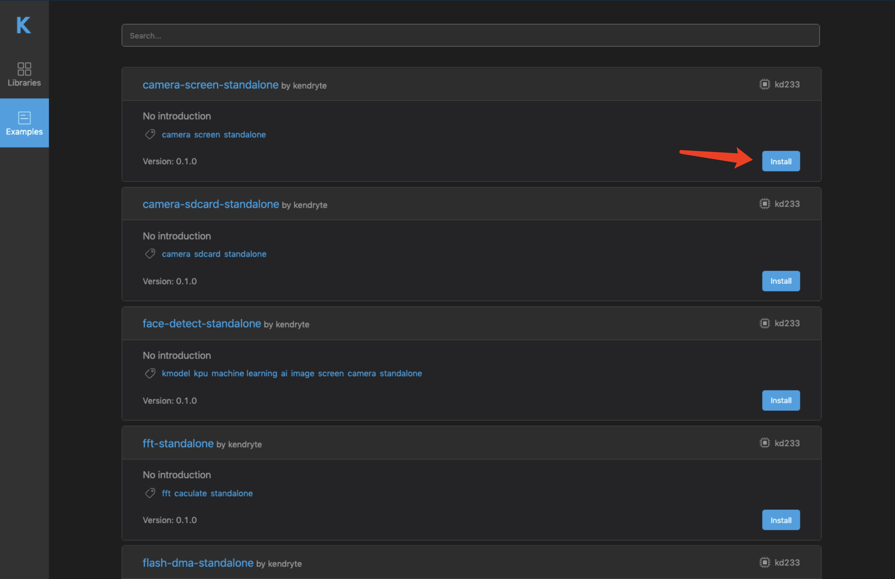
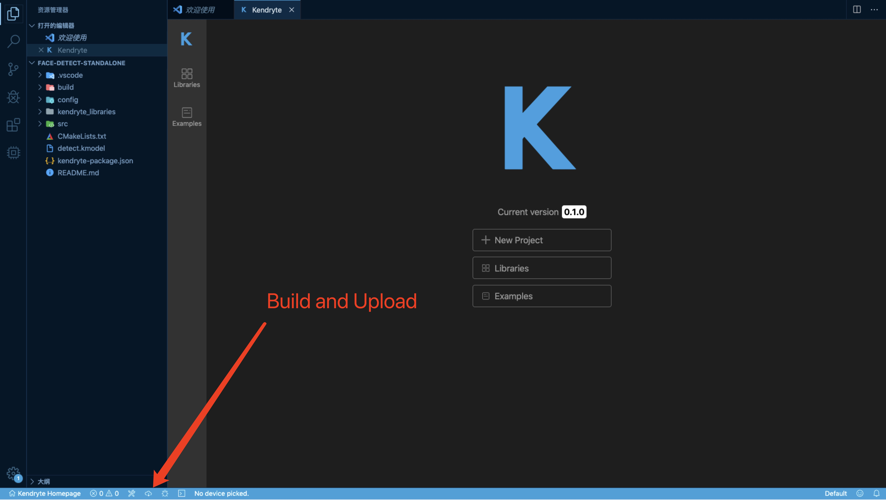
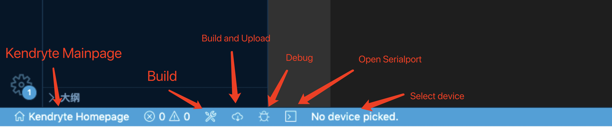

# Kendryte Dev Tool for Visual Studio Code

[中文版](./README.md)

- [Prepare](#Prepare)
- [Quick Start](#Quick\ Start)
- [Directory Structure](#Directory\ Structure)
- [Features](#Features)
- [Questions](#Questions)
  - [Windows](#Windows)
  - [MacOS](#MacOS)
  - [Linux](#Linux)

## Prepare

Install [VSCode](https://code.visualstudio.com/) on your computer. Search `Kendryte` on VSCode Extension Market and install. This development tool only support `Kendryte KD233` board for now.

### MacOS environment

1.Install Homebrew

``` bash
/usr/bin/ruby -e "$(curl -fsSL https://raw.githubusercontent.com/Homebrew/install/master/install)"
```

2.Install dependencies

``` bash
brew install libusb mpfr
```

### Linux environment

#### Install dependencies

``` bash
sudo apt install libftdi-dev libhidapi-dev libusb-dev
```

or

``` bash
sudo yum install libftdi hidapi libusb
```

#### Debugger permission

1.Download [60-openocd.rules](https://mirrors-kendryte.s3.cn-northwest-1.amazonaws.com.cn/60-openocd.rules) and put it on `/etc/udev/rules.d`

2.Reload `udev`

  ``` bash
    sudo udevadm control --reload
  ```

3.Add user to `plugdev` group

  ``` bash
    sudo usermod -aG plugdev $USER
  ```

## Quick Start

1.Kendryte controller will open after installed, click `Examples` tag to switch to the examples store.



2.Select an example and download.



3.Click the `build and upload` button for build and upload to board.



4.Check the board

## Directory Structure

``` Bash  
.
├── .vscode
├── CMakeLists.txt
├── README.md
├── build
│   ├── CMakeCache.txt
│   ├── CMakeFiles
│   ├── Makefile
│   ├── ai_image
│   ├── camera-standalone-driver
│   ├── cmake_install.cmake
│   ├── compile_commands.json
│   ├── ${Project-name}
│   ├── ${Project-name}.bin
│   ├── lcd-nt35310-standalone-driver
│   ├── standalone-sdk
│   └── w25qxx-standalone-driver
├── config
│   ├── device-manager.json
│   ├── flash-manager.h
│   ├── flash-manager.json
│   ├── fpioa-config.c
│   ├── fpioa-config.h
│   └── ide-hook-main.c
├── detect.kmodel
├── kendryte-package.json
├── kendryte_libraries
│   ├── ai_image
│   ├── camera-standalone-driver
│   ├── lcd-nt35310-standalone-driver
│   ├── standalone-sdk
│   └── w25qxx-standalone-driver
└──  src
     └── main.c
```

- .vscode: The contents of this directory are automatically generated, include debug option, build commands and extension's config.
- CMakeLists.txt: This file is automatically generated when build.
- build: The contents of this directory are compiled product. The `${Project-name}.bin` and `${Project-name}` file are target file.
- config: The content of this directory include pin definitions and model address assignment. It can be overwrited.
- detect.kmodel: Kendryte model。
- kendryte-package.json: The config file of project. Include project name, source files and so on. It can be overwrited.
- kendryte_libraries: This directory is dependencies installation directory. All of dependencies will download on this directory. You shouldn't modify the contents of this directory most of the time.
- src: Source files.

## Features




## Questions

### Windows

1. Q: Openocd report error: libusb_error_not_supported?

    A: Please download [Zadig](https://zadig.akeo.ie/) and switch `JLink` driver to `Libusb`。

### MacOS

### Linux

1. Q: Openocd report error: libusb_error_access?

    A: Please read [Debugger permission](#Debugger\ permission) to get the debugger permission and plug in device again. If you still have this problem, please contact us on issue.

2. Q: Why extension request sudo permission on upload?

    A: If current don't have permission to read serialport device, it will request sudo permission. You can also config serialport devices permission by yourself.
